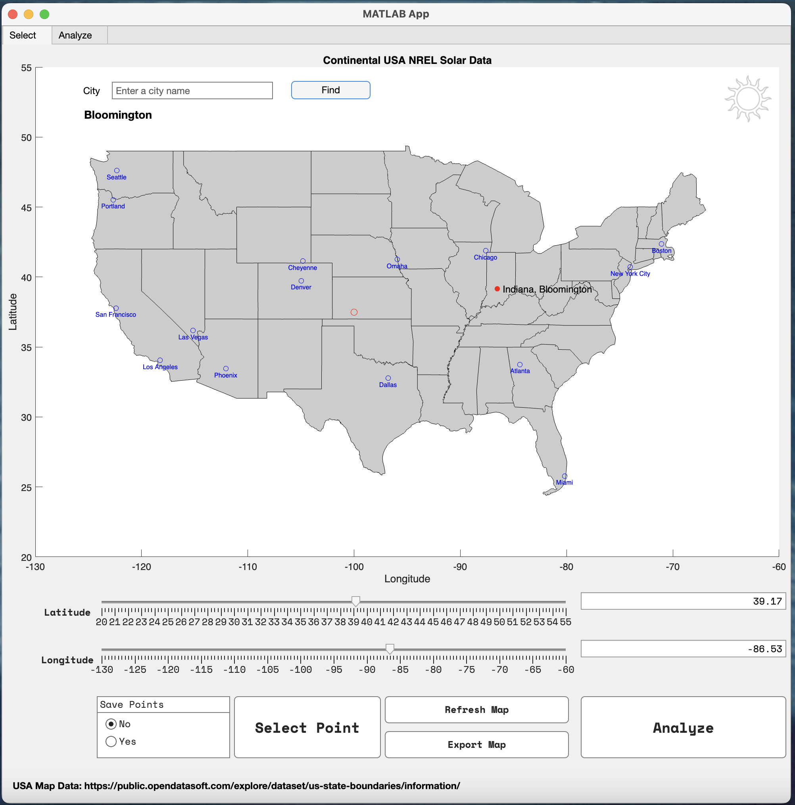
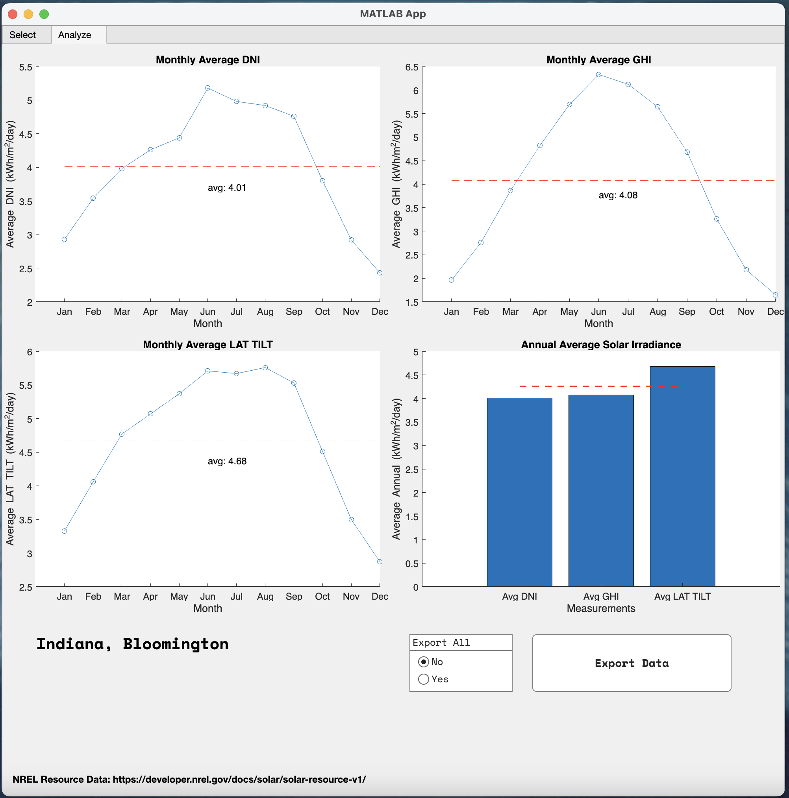

# NREL Solar Data App

With this Matlab app it is possible to access the solar data in the NREL database. The app is based on the NREL API and the user can access the solar data for continental USA by selecting a location. The solar data from the NREL measurements for the selected location is then displayed in a graph. The user can also download the data in a JSON file. Multiple points can also be selected and the data for all the points can be exported in a single JSON file.

## Usage

To use the app, the user needs to have a NREL API key. The key can be obtained by registering at the NREL website1,2. The key needs to be entered in the app before the data can be accessed. Also an OpenWeatherMap3 API key is needed to access location data. The key can be obtained by registering at the OpenWeatherMap website. The key needs to be entered in the app before the location data can be accessed.

Simple use case is presented [here](https://youtu.be/PZGQp4jDT-Q)

## License

MIT License. Icon by [Gulraiz](https://www.flaticon.com/authors/gulraiz).

---

1 [NREL API Sign Up](https://developer.nrel.gov/signup/)
2 [NREL Solar API](https://developer.nrel.gov/docs/solar/solar-resource-v1/)
3 [OpenWeatherMap API](https://openweathermap.org/api)
